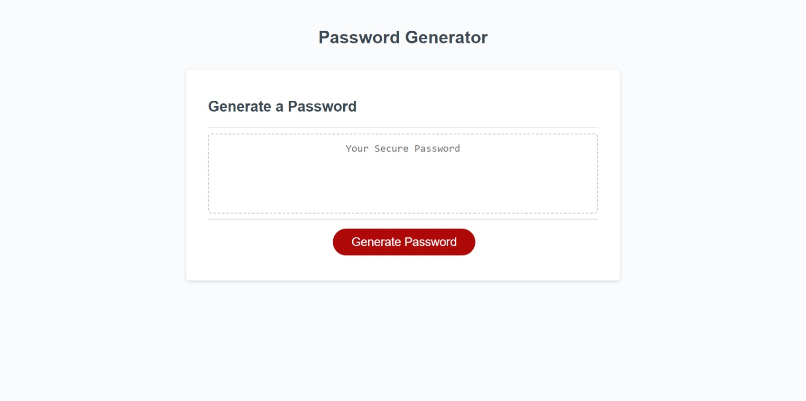

# Secure_Password_Generator

## Description
In this week challenge #3, I was tasked to modify an starter code to create an application that enables employees to generate random passwords based on criteria that they’ve selected. This app is an browser-based application which means it will run in the browser and will feature dynamically updated HTML and CSS powered by JavaScript code. Likwise, the final application have a integrated clean and polished, responsive user interface that adapts to multiple screen sizes. In addition, the application is run as series of propmts to help the users meets certain criteria to generate their secure password.

## Acceptance Criteria
GIVEN I need a new, secure password

WHEN I click the button to generate a password

THEN I am presented with a series of prompts for password criteria

WHEN prompted for password criteria

THEN I select which criteria to include in the password

WHEN prompted for the length of the password

THEN I choose a length of at least 8 characters and no more than 128 characters

WHEN asked for character types to include in the password

THEN I confirm whether or not to include lowercase, uppercase, numeric, and/or special characters

WHEN I answer each prompt

THEN my input should be validated and at least one character type should be selected

WHEN all prompts are answered

THEN a password is generated that matches the selected criteria

WHEN the password is generated

THEN the password is either displayed in an alert or written to the page

## Technologies
The technologies I used in this challenge includes:
1. HTML: template working HTML file was given that structure the basic layout of the password generator application.
2. CSS: template working CSS file was given which included the styling of the password generator application.
3. Js: JavaScript ro interact with websites and browsers, and to connect servers to websites as well as web applications.
4.  Github: Github was used to create a repository which includes the links to the projects, assets folder, and the README file.
5. Giblab: Giblab was used to clone the project to our laptop.

## Installation

To install the challenge #3 project, first create a new repository in your GitHub account, and then clone this repository to your local computer.

To clone: git clone https://github.com/your-username/repository-name.git

## Deployment

1. Deploy your code by running "git add", "git commit", and "git push" in your local repository.

2. Visit your GitHub repository online, click 'Settings', and then select 'Pages' on the left.

3. In GitHub Pages, set the 'main' branch as the source and click 'Save'.

4. Access your live site at <your-github-username.github.io/your-repository-name>. For example, if your username is "lernantino" and your repo is "css-demo-site", the URL is <lernantino.github.io/css-demo-site>.

## Screenshot

   
    

## Resources
[W3schools_JavaScript](https://www.w3schools.com/js/)

[MDN web docs_JavaScript](https://developer.mozilla.org/en-US/docs/Web/JavaScript)

